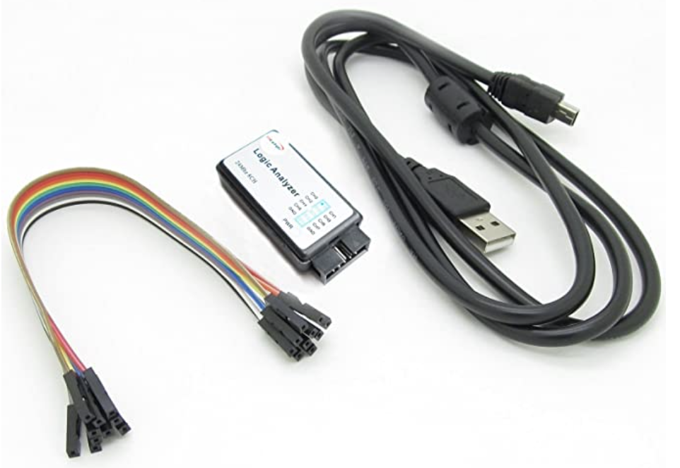
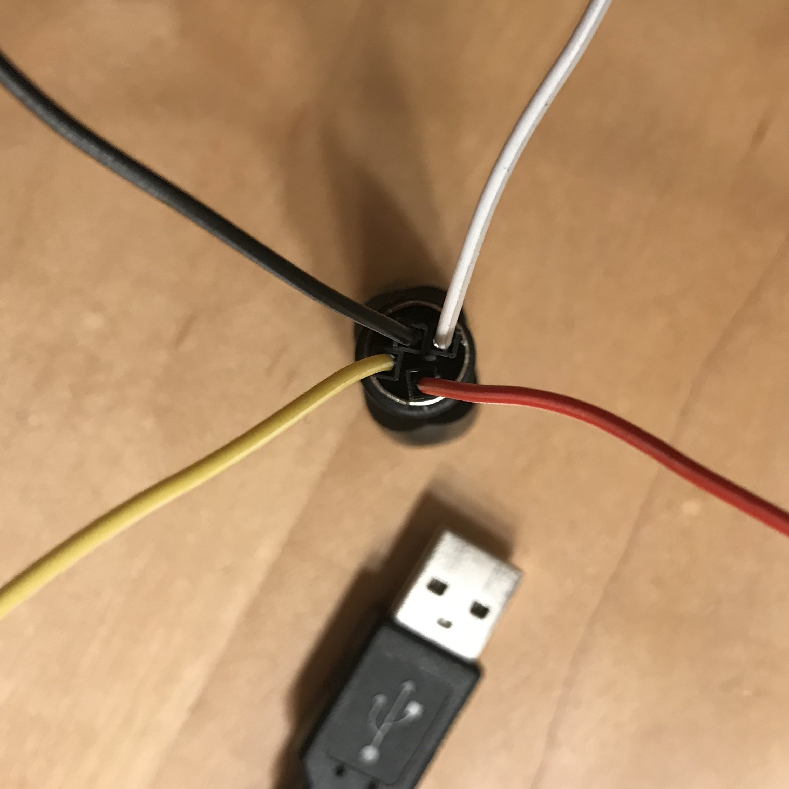
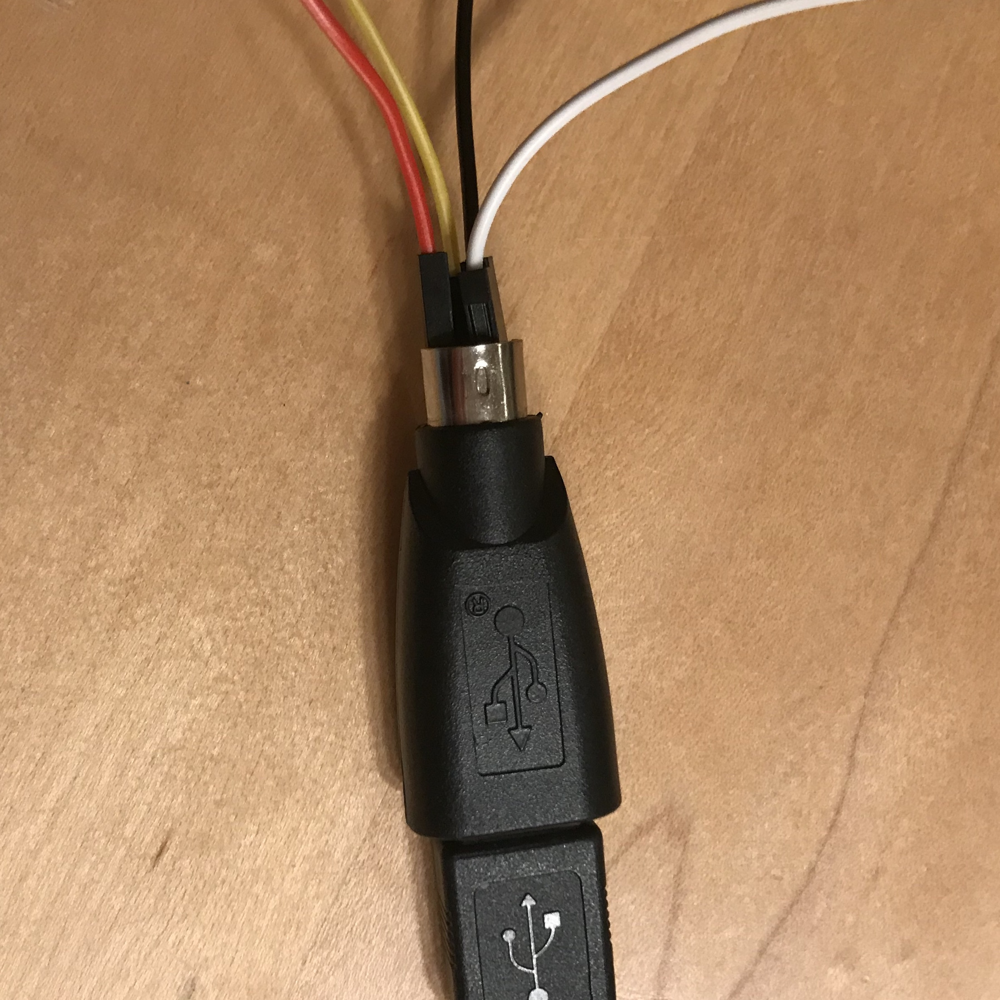
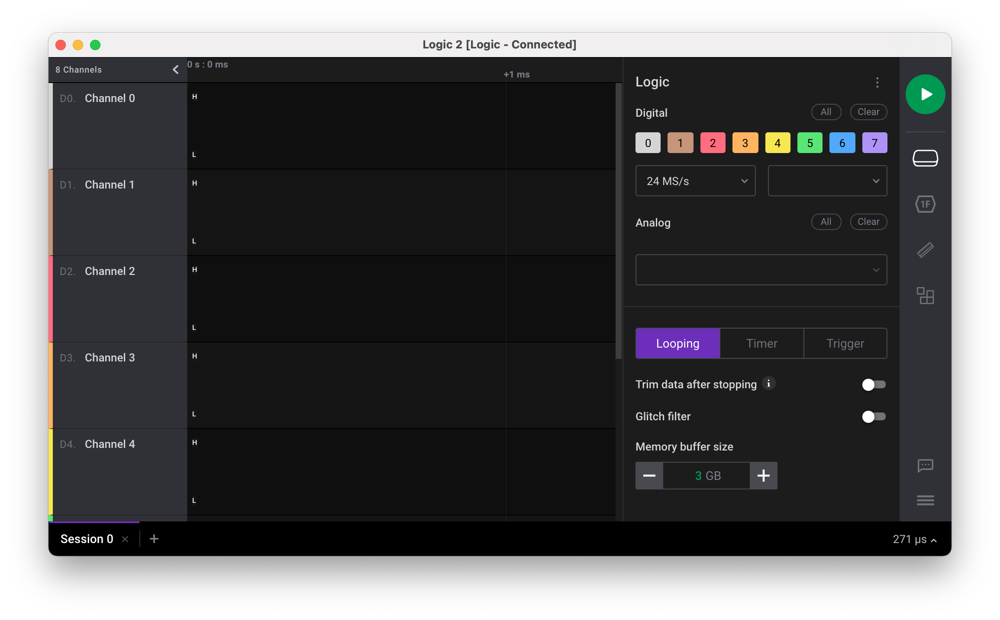
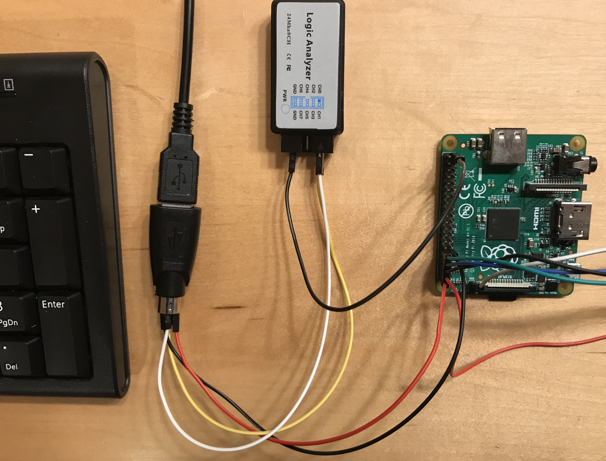


Task list to copy/paste when creating PR for this lab:

__Before releasing lab5:__
- [ ] Review writeup/code/checkin questions (instructor)
- [ ] Walk through (SL)
- [ ] Followup on issues from previous quarter postmortem (issue #)
- [ ] Update instructions/photos for non-Saleae analyzers, consider PulseView instead of Logic app?

__To prep for lab5:__
- [ ] Confirm there are sufficient number of working PS/2 keyboards to check out one to each student (Label each keyboard with number for tracking). Add column to lab attendance to record keyboard number checked out to student.
- [ ] Confirm there are 4-6 logic analyzers in lab cabinet, also 4-5 non-Inland keyboards to analyze
- [ ] Print copies of PS/2 key code chart (assignments/assign5/images/scancode.gif)



*Lab written by Philip Levis, updated by Pat Hanrahan*

## Goals

In your next assignment, you will write a PS/2 keyboard driver for your Pi. The goal of this lab is to set up the
keyboard so that you can immediately start on the assignment.

During this lab you will:

- Install jumpers into your PS/2 keyboard mini-DIN connector.
- Watch the signals from the keyboard using a logic analyzer.
- Print out the scancodes sent by the keyboard.
- Write code to decode the PS/2 protocol to produce scancodes.
- Write code to use C function pointers as a command dispatch table.

## Prelab preparation
To prepare for lab, do the following: 

- Pull the latest version of the `cs107e.github.io` courseware repository.
- Clone the lab repository
   `https://github.com/cs107e/lab5`.
- We will be using the Saleae `Logic 2` application to visualize the signals captured by the logic analyzer. Saleae <http://saleae.com> is a company known for its high-quality logic analyzers and software.  Here is the page with [links to download Logic 2](https://ideas.saleae.com/f/changelog/). Download and install the version for your platform. If using WSL, download the Windows version.
- Review the [slides from the Keyboard lecture](/lectures/Keyboard/slides.pdf) and this document detailing the [PS/2 protocol](https://web.archive.org/web/20180302005138/http://computer-engineering.org/ps2protocol/). Print a copy of this [PS/2 key code chart](images/scancode.gif) and have it on hand.
- Extra supplies needed in lab this week:
    - __PS/2 keyboard__ (including __USB to PS/2 plug adapter__)
        {: .zoom .w-50}
    -  __Logic analyzer__ 
        {: .zoom .w-25}

## Lab exercises

### 1. Install jumpers in your PS/2 keyboard connector

Most modern keyboards are USB keyboards.  Unfortunately, the USB
protocol is complicated; over 2,000 lines of code are needed to
interface with a USB keyboard.  Instead, we will
interface with a PS/2 keyboard, which uses a simple serial protocol
that is easy to decode.  The PS/2 keyboard appeared on the original
IBM PC. Computers have long since stopped including a PS/2 port as standard equipment so we will wire a direct connection from the PS/2 connector to the GPIO pins on the Raspberry Pi. The keyboard in your kit is a USB keyboard that can also operate in PS/2 mode.  The keyboard is wired with a USB plug and includes a USB to PS/2 plug adapter.

There are two common PS/2 devices: a keyboard and a mouse.  PS/2
devices connect to a PC using a 6-pin
[mini-DIN connector](https://en.wikipedia.org/wiki/Mini-DIN_connector).
By convention, mice use a green connector and keyboards use a
purple connector.  Inspect the inside of the mini-din PS/2 connector. It contains a plastic tab (that forces you to  plug it in with the correct polarity) and 6 male pins. Two pins are NC (not-connected), and the others carry VCC, GND, DATA and CLK.


Identify which four pins correspond to VCC, GND, DATA, and CLK. Install a female-to-female jumper onto each pin. Use the following convention: red for VCC, black for GND, yellow for DATA, and white for CLK.

The VCC jumper has no neighbors, but the other three are squashed together and it is a pretty tight fit. We suggest you install CLK and DATA first, then cram the GND header in between the two. It takes a bit of force and perhaps use of pliers, but then everything is tightly wedged in there and feels very secure.


To ease the crowding, you can remove the plastic housing from one of the jumpers. Pry up the black tab on the side of the housing and the crimped pin will slide right out. (Video demonstration: <https://www.youtube.com/watch?v=-InoAbkNVdQ>)


{: .zoom .w-50 .float-left}
{: .zoom .w-50 .float-right}
<p>&nbsp;</p>

### 2. Use a logic analyzer to visualize keyboard signals

We're going to use a logic analyzer to examine the signals sent by the keyboard. 


> __Tip__
> Choose a keyboard __without__ an "Inland" logo to use with the logic analyzer.  The Inland keyboards require pull-up resistors on the clock and data lines to handshake correctly. When using these keyboards with your Pi, you will configure the clock and data GPIOs to use the Pi's internal pull-ups. To use with the logic analyzer, we would need to bust out some hardware resistors. Instead just analyze one of the non-Inland keyboards.
{: .callout-info}


Open the *Logic 2* application you installed on your laptop as prelab preparation. The start-up screen should be similar to this:


Once you plug the logic analyzer into your computer, the screen will look like this:



Familiarize yourself with the hardware of the logic analyzer. It has a bank of pins that correspond to the different signals or _channels_ to be monitored by the analyzer. The analyzer supports reading up to 8 simultaneous channels. The analyzer uses a USB connection to your laptop to receive power and send data.


The Saleae analyzers have a custom wiring harness that plugs into the channel pins for channels 0 through 7. Each channel has a pair of jumpers; a colored one for signal, and black for ground.  The ground line for each channel is directly underneath its signal line. 


On the analyzer, identify the pins for channels 0 and 1. You are going to connect these two channels to the CLK and DATA pins of your PS/2 keyboard. Connect the white CLK jumper you placed in your PS/2 keyboard plug to channel 0 on your analyzer and connect the yellow DATA jumper to channel 1.

You must also ground the logic analyzer. Identify the ground pin and use a black jumper to connect it to a ground pin on your Raspberry Pi. There may be a separate ground per channel or one shared ground, depending on the model of logic analyzer you are using.

You need to supply power to your keyboard.  Connect the VCC and GND jumpers from your keyboard connector to 5V and GND pins on your Raspberry Pi.

Lastly, connect the USB cable from the logic analyzer to a USB port on your laptop.

This is what it looks like when the keyboard is wired up to the logic analyzer.

{: .zoom .w-75}

In the Logic 2 application, hit the green start button in the upper right to start reading the signal. Activity on channels 0 and 1 is recorded and visualized. You can zoom in and out and pan left and right to see the details of the captured signal. You should see the characteristic pattern of the PS/2 protocol. 

The Logic 2 application provides protocol analyzers that can be applied to
the captured data. Click the `1F` icon on the right side of the window to display the  *Analyzers* pane. Click the `+` in upper right to access the list of analyzers and choose the PS/2 protocol analyzer. Configure it for CLK on channel 0 and DATA on channel 1. The captured data is now decoded according to the PS/2 protocol and displays the scancodes sent by the keyboard.


Hover over the visualization of the PS/2 clock channel to see the signal timing data. How far apart is each falling clock edge? At what frequency is the PS/2 clock running?  Is the keyboard operating with the range dictated by the [spec](https://web.archive.org/web/20180302005138/http://computer-engineering.org/ps2protocol/)? 

You're ready to answer the first check-in question[^1].


### 3. Run keyboard test

We're now ready to try reading the keyboard signals on the Pi. Disconnect the logic analyzer from the keyboard and your laptop.  Connect the white jumper (CLK) from your PS/2 connector to GPIO 3 on your Raspberry Pi
and the yellow jumper (DATA) to GPIO 4.

Here is what it should look like if everything is connected up properly.

{: .zoom .w-75}

> To keep things simple for lab, we had you disconnect the logic analyzer when connecting the clock and data lines to the Pi, but another useful configuration is to connect the keyboard to __both__ the logic analyzer and the Pi. This allows the analyzer to "snoop" on the same signal being read and processed by the Pi. Run the lines through your breadboard to facilitate connecting to both. 
> {: .callout-info}

The `keyboard_test` application uses the reference implementation of the keyboard driver. Let's try it now:

```console
% cd code/keyboard_test
% make run
```
Type keys on the PS/2 keyboard and the program should print the scancodes received. If you aren't getting events, check your wiring.

Note that scancodes are not ASCII characters. Instead, these values relate to the physical placement of the key on the keyboard.  Inside the keyboard, there's a 2D matrix of wires that generates the scancode bits. It is the keyboard driver that will implement the logic to lookup that code and generate the appropriate ASCII character. 

Each key press and key release is reported as a distinct action. Press a key; the keyboard sends a scancode. Release the key; the keyboard sends another scancode; this code is same as the first one, except
it is one byte longer: it has a leading `0xF0`. Tap the `z` key now. The keyboard sends `0x1A` on key press, followed by `0xF0` `0x1A` on key release.

If you press `z` and hold it down, the keyboard enters auto-repeat or _typematic_ mode where it repeatedly generates key press actions until you release the key.  Press and hold `z`and watch for the repeat events to start firing. About how long does it seem to take for auto-repeat to kick in? At about what rate does it seem to generate auto-repeat events?  

Type some single letters to observe the codes for press,
release, and auto-repeat.  Then try typing modifier keys like Shift and Alt. Try pressing more than one key at a time. 

* What sequence of codes do you see when typing (capital) `A`? What does this tell you about what will be required for your keyboard driver to handle the Shift or Control keys?  You're ready for the second check-in question [^2]

A note on __N-key rollover__: The PS/2 protocol reports a key action with an individual scancode. If the user simultaneously presses N keys on a PS/2 keyboard, the keyboard should report this state by sending N scancodes, i.e., there is no limit on the number of key actions that can be detected and reported.  In contrast, the USB protocol asks the keyboard for the current state and the keyboard's answer is limited to reporting at most 6 pressed keys, i.e., USB is constrained to 6-key rollover. Ty observing this on your laptop keyboard (which is likely USB). Open your editor or use the Mac "Keyboard Viewer" to visualize (In Preferences->Keyboard, enable "Show keyboard and emoji view in menu bar", then choose "Open Keyboard Viewer" from input menu). Hold down one letter, then two, and so on, and you'll reach a point at which no further key presses are detected. 

While the PS/2 protocol has no limitation and in theory allows full N-key rollover, in practice, the internal wiring of many PS/2 keyboards shares circuity among keys rather than wire each key independently. As a result, as you hold down more and more keys on your PS/2 keyboard, you'll likely reach a point where additional keys are mis-detected. Try it now on your PS/2 keyboard. How many simultaneous keys can your keyboard reliably detect?

Here is a good explanation from Microsoft Research on [N-key rollover and keyboard circuitry](http://web.archive.org/web/20180112133411/https://www.microsoft.com/appliedsciences/content/projects/AntiGhostingExplained.aspx) if you want to learn more.

### 4. Implement ps2_read and keyboard_read_sequence

Your final achievement will be to get a start on writing your own keyboard driver. We want you to do this in lab because it touches on both
hardware and software, so it can be tricky to debug; it helps to
have staff around!

Change to the directory `code/my_keyboard`. This is the
same application as `code/keyboard_test`, except that rather than
using the reference implementation, you are going to write your own code to read scancodes and sequences.

[Browse the headers](/header) for ps2.h and keyboard.h to review the module documentation. The `ps2` module manages the low-level communication with a PS2 device. The `keyboard` module layers on the ps2 module to interpret scancodes into typed keys. During lab, you will implement initial versions of the functions `ps2_read` in `ps2.c` and `keyboard_read_sequence` in `keyboard.c`.

Open `ps2.c` in your text editor. The function `ps2_new` has already been written for you.  This function configures a new PS2 device for the specified clock and data gpio. In the library modules we have seen thus far, we have used global variables to store data that is shared across the module. A single set of global variables for the ps2 module does not work, as each device needs its own independent settings (i.e clock and data gpio). `ps2_new` creates a new struct to hold the per-device settings. Because that memory needs to be persistent after the function call exits, it allocates memory using your shiny new `malloc` . The rest of the function is setting the clock and data GPIOs as inputs and enabling the internal pull-up resistor so these pins default to high, as expected in the PS/2 protocol.

The function `ps2_read` reads the individual bits that make up a scancode. We want you to write this function here in lab as a start on your next assignment.

Before reading each bit from the data line, a PS2 device must first wait for the falling edge on the clock line. You will need to repeatedly do these tasks and rather than replicate code, we suggest you define a private helper function `read_bit`. The helper waits until observes the transition from high to low on the clock line and then reads a bit from the data line. Unifying repeated code into a shared helper aids readability and maintainability; this is a good habit to adopt.

A scancode transmission consists of 11 bits: a start bit (must be
low), 8 data bits, a parity bit, and a stop bit.  To synchronize with the keyboard, `ps2_read` should verify that first bit read is a valid start bit, e.g. is 0. If not, discard it and read again until a valid start bit is received.  Next, read the 8 data bits. 

* In which order do the 8 data bits arrive? [^3]  *Hint: if you're not sure, take a look at the signal you captured for the keyboard's data line with the logic analyzer, or look back at the PS/2 protocol documentation linked in the prelab.*

Lastly, read the parity and stop bits. For the assignment, your driver will validate these bits have the correct values, but for lab, just read the bits and assume they are correct. 

The function `keyboard_read_scancode` in `keyboard.c` simply calls `ps2_read` to get the next scancode.  This means that once you have a working `ps2_read`, your `keyboard_read_scancode` should automatically spring to life. Build and run the application and see that it receives each scancode sent by the keyboard.

The higher-level functions of the keyboard module process scancodes into sequences, actions, and typed keys. For example, the next layer up from raw scancodes is `keyboard_read_sequence` . This function recognizes when a scancode is not a standalone action, but part of a larger sequence, such as the two scancodes sent together for a key up action. Review the PS/2 protocol to see the format of those two and three-byte sequences and then edit the body of `keyboard_read_sequence` to read a sequence of 1, 2, or 3 scancodes as appropriate and return the key action corresponding to the entire sequence.

If your implementation of `ps2_read` and  `keyboard_read_sequence` are working correctly, you should be able to compile your application and have it act identically to the `keyboard_test` version you tested in Step 3. If you run into any snags, please be sure to get help from us now so that you'll be able to hit the ground running on the assignment. Show us your working code before leaving lab! [^4]

### 5. C function pointers
Recall the [memory diagram](/labs/lab4/images/stack_abs.html) you studied so intently in last week's lab and assignment. Each function has its sequence of instructions stored in memory in the `text` section. When making a function call such as `abs(4)`, the `bl abs` instruction branches to the start address for the `abs` function (0x8010). The start address for a given function is established by the linker when it lays out the executable sections as specified in memmap.

This underlying mechanism to call a function by branching to its address is not limited to use just by the compiler! In the C language, you can also refer to a function by its address and invoke the function through a _function pointer_. The concept may seem a bit wacky at first, but allowing instructions/code to be treated as data is a powerful technique with many applications. In fact, function pointers are key to supporting the entire notion of object-oriented programming!

Change to the directory `code/dispatch`. This program in this directory implements a very simple calculator. The calculator accepts a string input with a binary arithmetic expression such as "5+7" and returns the evaluated result, 12 in this case. Review the functions `calc_evaluate` and `apply_operation` to see how the calculator operates. The initial approach of `apply_operation` is to manually select the operator to apply using cascading if-else statements.

Edit the function `apply_operation` to add support for a new `divide` operator. Add a test case to `main.c` and confirm the new operator.  These changes are simple enough, but the growing chain of individual cases and repeated code in `apply_operation` does not make for a pleasing design. Instead of adding further cases to `apply_operation`, let's re-work the design to dispatch via function pointers.  

At the top of `calc.h` is this typedef:
```
typedef int (*binary_fn_t)(int, int);
```
This strange-looking declaration introduces a user-defined type called `binary_fn_t`. `binary_fn_t` is a pointer to a function that takes two int arguments and returns an int. The "pointee" type of a function pointer is not any old function, the function needs to match the specified prototype. To be compatible with `binary_fn_t`, a function must have two int arguments and return an int. (This may be a good time to mention the handy *[cdecl tool](https://cdecl.org/?q=int+%28*binary_fn_t%29%28int%2C+int%29%3B)* for help deciphering tricky C declarations)

Here is a sample use of a `binary_fn_t` function pointer:

```
int max(int a, int b)
{
    return a > b ? a : b;
}

void main(void) {
    binary_fn_t myfn;
    myfn = max;
    int m = myfn(8, 3);
    ...
```

`myfn` is a pointer variable and stores an address. Under the hood, assigning `myfn` to `max` stores the address of the first instruction of `max` into the pointer variable. When making the call to `myfn`, the compiler branches to the address stored in the pointer variable.

In the above example, the function pointer is overkill, as we could have just directly called `max` at compile-time, but this technique becomes powerful to select among different options at runtime.

Take a look at the code for the `calc_add_operator`  and `calc_init` functions. The calculator module declares `operators` as a global array of structs. Each struct associates an operator character with its function pointer.

Edit the `apply_operation` function and remove the if-else and individual cases per operator. Replace with a loop that searches the `operators` array for the matching character and invokes its associated function pointer. Test to see your new calculator in action. You have just implemented a _command dispatch table_. What additional code is required to include `divide` to the command dispatch table? How does that compare to the original?

The use of a command dispatch table makes for tidy code within the calculator module, and furthermore the module is now broadly extensible. The client code in `main.c` even adds its own `power` operator to the calculator, something that was not even possible in the original design. Neat!

You will use function pointers when implementing the `shell` module as part of your next assignment. Answer this final check-in question [^5] and you're good to go!

## Check in with TA

Before leaving lab, make sure your `keyboard_read_scancode` is working correctly. If you haven't made it through the whole
lab, we still highly encourage you to go through the parts you skipped
over, so you are well prepared to tackle the assignment.

[^1]: Back in lab1, we estimated how many instructions the Pi was executing (~20 million/second).  Today you measured the timing of PS/2 clock cycle.  Calculate how many instructions the Pi can execute in that time. Now consider a call to `printf`. Make a ballpark estimate of how many instructions must execute to process and output a single char, now multiply by length of the format string for rough total count. If your keyboard driver makes a call to `printf` in between reading bits that overruns your budget, what will be the consequence?

[^2]: What sequence of codes is sent when typing capital `A`?

[^3]: In a PS/2 scancode, does the least significant or most significant data bit arrive first?

[^4]: Show off that your implementation of `keyboard_read_scancode` correctly receives scancodes from your keyboard. 

[^5]: Explain what is meant by a _command dispatch table_ and how it adds flexibility and extensibility into a design.


[^6]: Confirm that we properly noted your keyboard id in our records.  You may take the keyboard with you, it is on loan to you for rest of quarter. Please take care of it and return it at the end of quarter.
